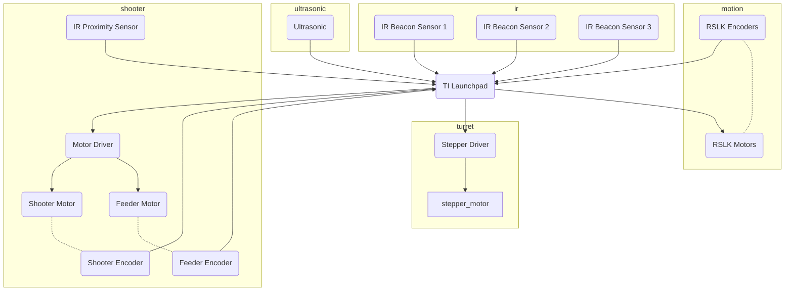
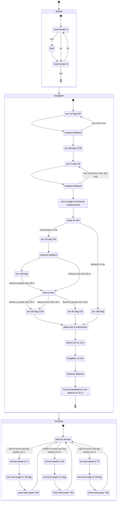

# Description of Operation

## Overview
The final robot design for this project is comprised of 5 subsystems and follows a 2 stage strategy when operating.

## Subsystems
The 5 subsystems handle the various functions of the robot and work together during competition to enable successful performance.

### Ultrasonic
The ultrasonic subsystem is responsible for using the ultrasonic sensor to take distance measurements. The ultrasonic sensor is mounted stationary to the base of the robot and angled such that it measures the distance to the wall of the court. The sensor sends out a short burst of ultrasonic sound waves and measures the time taken for the echo to be detected. This time and the speed of sound are used to calculate the distance to the surface off of which the sound was reflected.

### Motion
The built-in motors and encoders on the RSLK platform are used to move the robot. Independent PID loops were used for each motor to maintain motor speed across different surfaces (painted wood and electrical tape). The encoders were also used to track the total number of revolutions to accurately track distance traveled or degrees turned.

### IR
Three IR sensors were mounted stationary to the robot base and aimed such that each would be focused on a single IR beacon when the bot was in the shooting position. Each IR sensor is enclosed in a housing that limits it's field of view. The housing interiors were coated with a non-reflective paint to minimize reflections causing unwanted active readings.

### Turret
The turret uses a gear drive driven by a stepper motor to aim the shooter. It is mounted statically to the robot base and holds the turret. There is no encoder, but code was written to minimize jerk in order to avoid skipping steps, allowing the stepper motor alone to be sufficient for accurately maintaining aim.

### Shooter
The shooter is attached to the top of the turret and contains all necessary components for storing, feeding, and shooting balls. The back of the shooter acts as a tall, slightly tilted magazine for carrying extra balls. A geared feeder motor uses a rubber wheel to move balls from the magazine to the shooter. The feeder motor includes an encoder which is used to track the distance balls have moved through the feeder system. An IR proximity sensor is also used to track balls in the feeder system to handle for any inconsistencies in the distance between balls. The shooter itself consists of a larger DC motor attached to a flywheel via a timing belt. Another encoder is attached to the flywheel's shaft to read the flywheel speed and ensure that balls are shot at the correct velocity. A hood over the flywheel defines the shooting angle and also induces back-spin on the balls to increase the effectiveness of backboard shots and ultimately increase the tolerance for making a basket.

## Strategy
The two-phase strategy is designed to serve as a reliable method for successfully identifying and shotting the correct baskets. The first phase is focused on navigating the robot to a pre-defined shooting position and the second is focused on identifying and shooting baskets.

### Phase 1
In order to be able to shoot baskets, the robot must first reach the correct shooting position and orientation. This was chosen to the be the center of the court, facing straight at the center basket. It is also known that the robot will always start at a random orientation somewhere in the starting zone at the back of the court. The general idea is to first determine orientation, then reach the center line, and finally follow the center line to the shooting position.

The two key features of the starting zone taken advantage of is that the closest wall will always be the back wall and that the center line is the only line passing through it. With that in mind, the first step is to use the back wall to set the robot orientation. This is done by taking a set of distance measurements across a range of angles and determining at what angle the distance reaches a minimum. This angle is safely assumed to be the orientation at which the robot is facing directly at the back wall. Then, if the robot is not already on the center line, it simply uses a distance measurement parallel to the back wall to determine which side of the center line it is on and drive to it. Then the robot follows the center line to the first intersection, and than moves forward a set distance to the shooting position.

While in theory this should be sufficient for getting the robot in the correct position and orientation, it is not. The influence of various sources of error stack up to cause the robot to be far enough off of the desired position to potentially miss baskets. The first step in addressing this is to use the center line to straighted the robot such that it points straight. This is done by simply measuring the offset between the robot center and the center line at a known distance in front of and behind the shooting position. These two values in conjunction with the distances they were taken at can be approximated as making up the sides of a right triangle allowing the angle between the robot's orientation and centerline to be calculated. The robot then turns accordingly. Now that it is straight, the ultrasonic sensor is used again to adjust the robots distance from the front wall so that it is at the correct distance for making baskets.

### Phase 2
Now that the robot is in the shooting position, it's time to make some baskets! To do this the robot sits and waits for an IR beacon to become active. The robot then sets the turret angle to point at the active basket and shoots with the necessary power to make it. It then marks that this was the last basket shot at and waits for a different beacon to be active. This process repeats indefinitely (which in practice is until the last ball is shot and someone hits the reset button and removes the robot from the court).

## Block Diagram
_block diagram of the overall system_

## State Machine

## Schematic