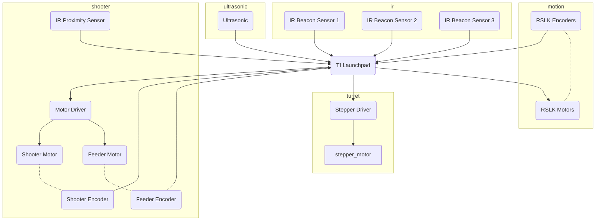
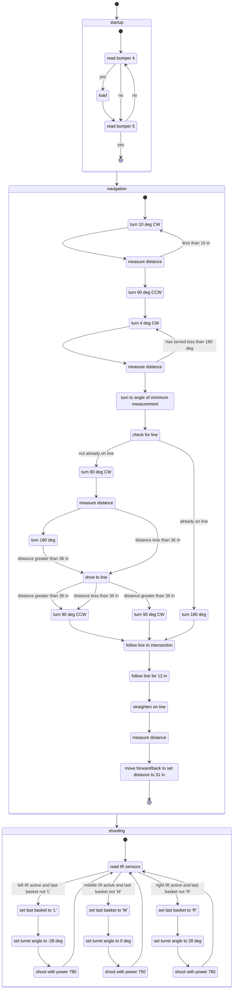

# Description of Operation

## Overview
_text description of the operation of the final system_

## Block Diagram
_block diagram of the overall system_

```mermaid
flowchart TD
launchpad(TI Launchpad)
rslk_motor(RSLK Motors)
rslk_encoder(RSLK Encoders)
motor_driver(Motor Driver)
stepper_driver(Stepper Driver)
shooter_motor(Shooter Motor)
feeder_motor(Feeder Motor)
shooter_encoder(Shooter Encoder)
feeder_encoder(Feeder Encoder)
ir_prox(IR Proximity Sensor)
ultra(Ultrasonic)
ir1(IR Beacon Sensor 1)
ir2(IR Beacon Sensor 2)
ir3(IR Beacon Sensor 3)

subgraph ultrasonic
ultra
end
ultra-->launchpad

subgraph ir
ir1
ir2
ir3
end
ir1-->launchpad
ir2-->launchpad
ir3-->launchpad

subgraph motion
rslk_motor
rslk_encoder
end
launchpad-->rslk_motor
rslk_encoder-->launchpad
rslk_encoder-.-rslk_motor

subgraph turret
stepper_driver
stepper_motor
end
launchpad-->stepper_driver
stepper_driver-->stepper_motor

subgraph shooter
motor_driver
shooter_motor
feeder_motor
shooter_encoder
feeder_encoder
ir_prox
end
launchpad-->motor_driver
motor_driver-->shooter_motor
motor_driver-->feeder_motor
shooter_motor-.-shooter_encoder
feeder_motor-.-feeder_encoder
shooter_encoder-->launchpad
feeder_encoder-->launchpad
ir_prox-->launchpad
```

## State Machine

```mermaid
stateDiagram-v2

s1001: read bumper 4
s1002: read bumper 5

s2001: turn 10 deg CW
s2002: measure distance
s2003: turn 90 deg CCW
s2004: turn 4 deg CW
s2005: measure distance
s2006: turn to angle of minimum measurement
s2007: check for line
s2008: turn 90 deg CW
s2009: measure distance
s2010: turn 180 deg
s2011: drive to line
s2012: turn 90 deg CCW
s2013: turn 90 deg CW
s2014: turn 180 deg
s2015: follow line to intersection
s2016: follow line for 12 in
s2017: straighten on line
s2018: measure distance
s2019: move forward/back to set distance to 31 in

s3001: read IR sensors
s3010: set last basket to 'L'
s3011: set turret angle to -28 deg
s3012: shoot with power 780
s3020: set last basket to 'M'
s3021: set turret angle to 0 deg
s3022: shoot with power 750
s3030: set last basket to 'R'
s3031: set turret angle to 28 deg
s3032: shoot with power 780

[*] --> startup
state startup {
    [*] --> s1001
    s1001 --> load: yes
    load --> s1002
    s1001 --> s1002 : no
    s1002 --> s1001: no
    s1002 --> [*]: yes
}
startup --> navigation
state navigation {
    [*] --> s2001
    s2001 --> s2002
    s2002 --> s2001: less than 16 in
    s2002 --> s2003
    s2003 --> s2004
    s2004 --> s2005
    s2005 --> s2004: has turned less than 180 deg
    s2005 --> s2006
    s2006 --> s2007
    s2007 --> s2008: not already on line
    s2008 --> s2009
    s2009 --> s2010
    s2010 --> s2011: distance greater than 36 in
    s2011 --> s2012: distance greater than 36 in
    s2009 --> s2011: distance less than 36 in
    s2011 --> s2012: distance less than 36 in
    s2011 --> s2013: distance greater than 36 in
    s2007 --> s2014: already on line
    s2012 --> s2015
    s2013 --> s2015
    s2014 --> s2015
    s2015 --> s2016
    s2016 --> s2017
    s2017 --> s2018
    s2018 --> s2019
    s2019 --> [*]
}
navigation --> shooting
state shooting {
    [*] --> s3001
    s3001 --> s3010: left IR active and last basket not 'L'
    s3010 --> s3011
    s3011 --> s3012
    s3001 --> s3020: middle IR active and last basket not 'M'
    s3020 --> s3021
    s3021 --> s3022
    s3001 --> s3030: right IR active and last basket not 'R'
    s3030 --> s3031
    s3031 --> s3032
    s3012 --> s3001
    s3022 --> s3001
    s3032 --> s3001
}

```

## Schematic